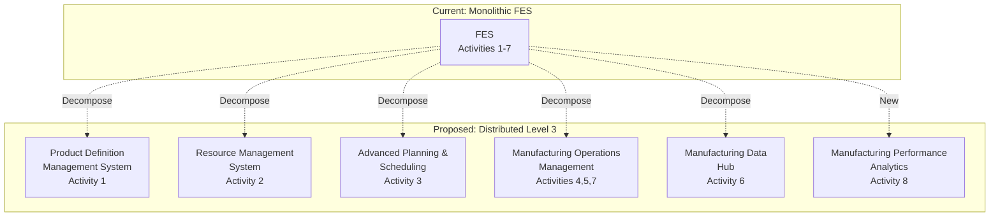
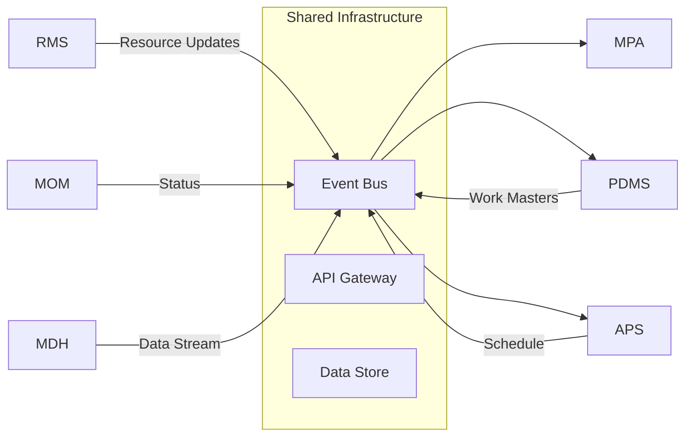

# FES Decomposition Strategy

## Current State: FES Monolith

FES currently owns 7 of 8 ISA-95 Level 3 activities:
1. ✓ Product Definition Management
2. ✓ Production Resource Management  
3. ✓ Detailed Production Scheduling
4. ✓ Production Dispatching
5. ✓ Production Execution Management
6. ✓ Production Data Collection
7. ✓ Production Tracking
8. ✗ Production Performance Analysis (orphaned)

## Proposed Decomposition Architecture

## Proposed Sister Systems

### 1. Product Definition Management System (PDMS)
**ISA-95 Activity**: Product Definition Management

**Responsibilities**:
- Maintain work masters and production rules
- Translate L4 product definitions to L3 manufacturing instructions
- Manage equipment-specific adaptations
- Version control for production specifications

**Interfaces**:
- **Inputs**: Part Service (BOM), Reference Services (materials, tools), DFM (manufacturability)
- **Outputs**: Work masters to MOM, routing to APS, specifications to MDH

**Why separate**: 
- Complex integration with multiple L4 systems
- Different change velocity than execution
- Could serve multiple factories

### 2. Resource Management System (RMS)
**ISA-95 Activity**: Production Resource Management

**Responsibilities**:
- Equipment capability modeling
- Tool and fixture tracking
- Labor skill management
- Material availability at shop floor

**Interfaces**:
- **Inputs**: Reference Services (tool specs), Maintenance systems
- **Outputs**: Available resources to APS, constraints to PDMS

**Why separate**:
- Different data model (resources vs products)
- Integration with maintenance/calibration systems
- Real-time availability tracking

### 3. Advanced Planning & Scheduling (APS)
**ISA-95 Activity**: Detailed Production Scheduling

**Responsibilities**:
- Finite capacity scheduling
- Work center sequencing
- Setup optimization
- Schedule simulation/scenarios

**Interfaces**:
- **Inputs**: DOM (orders), RMS (capacity), PDMS (routings)
- **Outputs**: Detailed schedule to MOM, promise dates to DOM

**Why separate**:
- CPU-intensive optimization algorithms
- Different user base (planners vs operators)
- May need cloud scaling

### 4. Manufacturing Operations Management (MOM)
**ISA-95 Activities**: Production Dispatching, Execution Management, Production Tracking

**Core Responsibilities**:
- Work order release (dispatching)
- Shop floor control (execution)
- WIP tracking
- Operator interfaces

**Why keep together**:
- Tight real-time coupling
- Same users (operators)
- Shared transaction model

**Interfaces**:
- **Inputs**: APS (schedule), PDMS (work instructions)
- **Outputs**: Execution status to all, completed work to MDH

### 5. Manufacturing Data Hub (MDH)
**ISA-95 Activity**: Production Data Collection

**Responsibilities**:
- Time-series data collection
- Event stream processing
- Data contextualization
- Short-term historian

**Interfaces**:
- **Inputs**: MOM (events), Equipment (sensor data), Quality systems
- **Outputs**: Contextualized data to MPA, real-time data to MOM

**Why separate**:
- Different technology stack (streaming vs transactional)
- Massive data volumes
- Different scaling patterns

### 6. Manufacturing Performance Analytics (MPA)
**ISA-95 Activity**: Production Performance Analysis

**Responsibilities**:
- KPI calculation and aggregation
- OEE analysis
- Quality analytics
- Predictive analytics

**Interfaces**:
- **Inputs**: MDH (all production data)
- **Outputs**: KPIs to L4, improvement opportunities to all L3 systems

**Why needed**:
- Currently missing
- Different technology (analytics/ML)
- Serves both L3 improvement and L4 reporting

## Integration Architecture

## Decomposition Patterns

### 1. Domain-Driven Design
Each system owns a distinct domain:
- PDMS: "How to make"
- RMS: "What we have"
- APS: "When to make"
- MOM: "Making it happen"
- MDH: "What happened"
- MPA: "How well we did"

### 2. CQRS Pattern
- **Command Systems**: MOM (execution commands)
- **Query Systems**: MPA (analytics queries)
- **Mixed**: PDMS, RMS, APS (both commands and queries)

### 3. Event Sourcing
- MDH as event store
- Other systems can replay events
- Audit trail built-in

## Migration Strategy

### Phase 1: Fill Gaps
1. Build MPA (missing capability)
2. Extract MDH (prepare for high-volume data)

### Phase 2: Vertical Splits
1. Extract PDMS (clear boundaries with L4)
2. Extract APS (when DOM is ready)

### Phase 3: Horizontal Split
1. Extract RMS (most complex due to data distribution)
2. MOM remains as streamlined execution engine

## Benefits of Decomposition

1. **Scalability**: Each system can scale independently
2. **Technology Fit**: Use appropriate tech for each domain
3. **Team Autonomy**: Different teams can own different systems
4. **Evolution**: Systems can evolve at different rates
5. **Risk Mitigation**: Failure in one doesn't bring down all
6. **Integration**: Cleaner interfaces with L4 systems

## Challenges to Address

1. **Data Consistency**: Across distributed systems
2. **Transaction Boundaries**: Some operations span systems
3. **Performance**: Network latency between systems
4. **Operational Complexity**: More systems to manage
5. **Migration Risk**: Moving from working monolith

## Related Considerations
- [[Open Questions - ISA-95 Mapping#13. System Ownership]] - Who owns each system?
- [[System Architecture Overview]] - How this fits overall architecture
- Event bus technology selection
- API standardization across L3