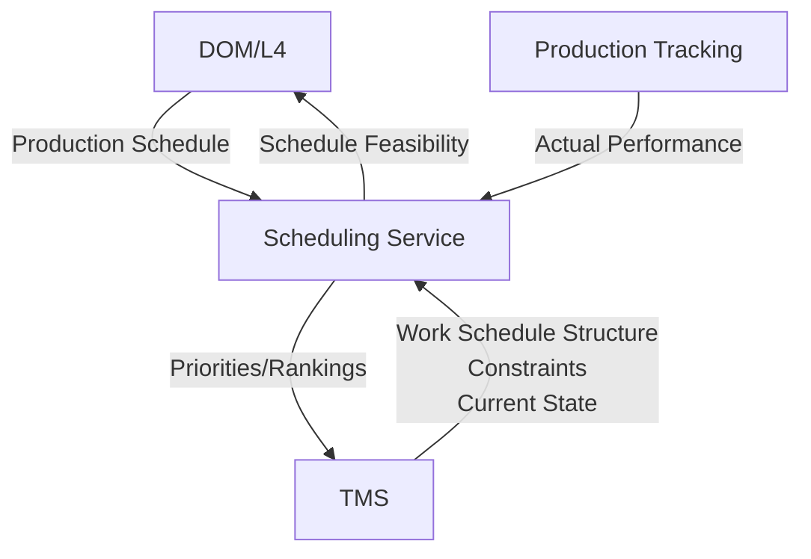

# ISA-95 Part 3 - Section 6.6 Detailed Production Scheduling

## Activity Definition (6.6.1)
Detailed production scheduling shall be defined as the collection of activities that take the production schedule and determine the optimal use of local resources to meet the production schedule requirements. This may involve ordering equipment and production requests, calculating cleaning, merging requests for optimal use of equipment and splitting requests when required because of batch sizes or limited production rates. Detailed production scheduling takes into account local situations and resource availability.

> **NOTE**: Enterprise-level planning systems often do not have the detailed information required to schedule specific work centers, work units, or personnel.

## Key Concepts from ISA-95

### Purpose of Detailed Production Scheduling
- Takes production schedule from L4 (enterprise level)
- Optimizes for LOCAL resources and constraints
- Handles the granular details that enterprise systems can't see
- Bridges the gap between business planning and shop floor execution

### Key Activities Include:
- Ordering equipment and production requests
- Calculating cleaning requirements
- Merging requests for optimal equipment use
- Splitting requests based on:
  - Batch size constraints
  - Limited production rates
  - Local resource availability

## Our System Mapping

### Current State Analysis

#### L4 → L3 Flow
- **Production Schedule** comes from L4 (our new DOM system)
- This is an aggregate of all current Production Requests
- In L4, Detailed Production Scheduling makes refinements to the production schedule for the site based on various overlapping concerns around products involved
- Also considers resource state

#### L3 Systems Gap
**We do NOT currently have a system in L3 that fully satisfies the Detailed Production Scheduling activity**

##### What We Have:
1. **TMS (Task Management System)**
   - Closest to this activity
   - Missing: Complementary system for global priority to tasks
   - Cannot provide site-wide optimization view

2. **FES (Factory Execution System)**
   - Handles Production Dispatching activity (next in the chain)
   - Does not handle the scheduling optimization

##### What's Missing:
- No handle on **Production Tracking** (Activity 7)
- This causes challenges:
  - Hard time actioning off Work Order Details page
  - No global view in Workflow Editor for site-wide production tracking

### Architectural Implications

#### The Scheduling Gap
Our current architecture has a significant gap between:
- **L4 DOM**: High-level production scheduling across sites
- **L3 FES**: Task-level execution without global optimization

This missing layer should:
1. Take DOM's production schedule
2. Consider local site constraints
3. Optimize task sequencing globally
4. Feed optimized dispatch list to FES

#### Production Tracking Dependency
The lack of Production Tracking (Activity 7) compounds the scheduling problem:
- Cannot feedback actual vs planned performance
- No real-time visibility for schedule adjustments
- Workflow Editor lacks global production view

## Design Considerations for Future L3 Scheduling System

### Requirements from ISA-95 Perspective
1. **Local Resource Awareness**
   - Equipment availability and capabilities
   - Personnel skills and availability
   - Material inventory levels
   - Maintenance schedules

2. **Optimization Capabilities**
   - Batch merging for efficiency
   - Request splitting for constraints
   - Cleaning/changeover optimization
   - Priority-based sequencing

3. **Integration Points**
   - **Input**: Production Schedule from DOM (L4)
   - **Output**: Optimized dispatch list to FES
   - **Feedback**: Actual performance from Production Tracking

### Potential Architecture Approaches

#### Option 1: Extend TMS
- Add global prioritization layer
- Integrate with DOM for schedule input
- Create optimization engine for task sequencing

#### Option 2: New Scheduling Service
- Purpose-built for ISA-95 Activity 3
- Sits between DOM and FES
- Could incorporate Production Tracking (Activity 7)

#### Option 3: Hybrid Approach
- TMS handles task-level details
- New service handles optimization and global view
- FES continues with execution

## Open Questions

1. **Scheduling Horizon**
   - How far ahead should L3 scheduling look?
   - How often should it re-optimize based on actual performance?

2. **Optimization Criteria**
   - What are our primary optimization goals? (throughput, changeover time, due dates, etc.)
   - How do we balance competing objectives?

3. **Human Override**
   - How much human intervention should be allowed in scheduling?
   - Where does automated optimization end and human judgment begin?

4. **Integration with Capacity Planning**
   - Should this system own capacity models?
   - How does it coordinate with QTO's capacity planning?

5. **Real-time Adaptability**
   - How quickly should scheduling adapt to disruptions?
   - What triggers re-scheduling?

## Next Steps

1. **Document current TMS capabilities** in detail
2. **Define requirements** for the missing scheduling layer
3. **Evaluate** whether to extend TMS or build new
4. **Design Production Tracking** solution (Activity 7) in parallel
5. **Create integration plan** with DOM and FES

## Related Notes
- [[ISA-95 Part 3 Activity Model Reference]]
- [[System Architecture Overview]]
- [[FES Decomposition Strategy]]
- [[Open Questions - ISA-95 Mapping]]

## Study Notes from Discussion

### Key Insight: The L3/L4 Boundary Challenge
The fact that our "Production Schedule" is coming from L4 but needs significant L3 refinement highlights a common challenge in ISA-95 implementations. The standard assumes clear boundaries, but modern systems often need more fluid interactions.

### TMS Evolution Path
TMS being "closest" but incomplete suggests an evolution path rather than replacement. Adding complementary systems for global priority might be more practical than wholesale replacement.

### The Production Tracking Problem
The lack of Production Tracking isn't just a reporting issue - it's blocking effective scheduling. Without knowing actual vs planned performance, any scheduling optimization is flying blind.


## Clarification: TMS and Work Schedule Structure

### What TMS Already Provides
After further discussion, we discovered TMS actually **does** model the Work Schedule concept from ISA-95:

```
Work Schedule Hierarchy in TMS:
├── Area
│   ├── Cell
│   │   ├── Station 1 → Work Schedule
│   │   ├── Station 2 → Work Schedule
│   │   └── Station n → Work Schedule
│   └── Cell n...
└── Area n...
```

**Key Points:**
- Each station has its own work schedule
- Work schedules contain multiple work orders
- The structure exists but lacks optimization/prioritization

### The Actual Gap: Scheduling Intelligence
The missing piece is not the work schedule structure, but the **Detailed Production Scheduling logic** that:
1. Takes production schedules from DOM
2. Optimizes across all station work schedules
3. Sets priorities/rankings for work orders
4. Handles dynamic re-optimization

### Architectural Insight
TMS was designed with a future scheduling service in mind - this shows good architectural planning:
- Clean separation of concerns
- Work schedule structure (TMS) vs optimization logic (future service)
- Prepared integration points for priority updates

## Future Scheduling Service Design Considerations

### Integration with TMS
Since TMS was designed with this in mind, key questions for the scheduling service:

1. **API Design**
   - How will scheduling service update work schedule priorities?
   - Event-driven (push) or polling (pull) model?
   - Bulk updates vs incremental changes?

2. **Data Model Alignment**
   - What information does TMS expose about work schedules?
   - What constraints/capabilities per station?
   - How are dependencies between work orders modeled?

3. **Optimization Scope**
   - Single area optimization vs global site optimization?
   - How to handle inter-area dependencies?
   - Real-time vs batch scheduling runs?

### Scheduling Service Responsibilities



### Key Design Decisions

1. **Optimization Algorithm**
   - Constraint-based scheduling?
   - AI/ML optimization?
   - Rule-based with human override?

2. **Scheduling Horizon**
   - How far ahead to schedule?
   - Frequency of re-optimization?
   - Handling of rush orders?

3. **Integration Patterns**
   - Does scheduling service own the schedule or just compute priorities?
   - How to handle conflicts between human overrides and optimization?
   - Feedback loop with Production Tracking for continuous improvement?

### Relationship to Production Tracking
The lack of Production Tracking (Activity 7) will limit the scheduling service effectiveness:
- No feedback on actual vs planned performance
- Cannot learn from historical data
- No real-time adjustments based on execution

Consider developing Production Tracking in parallel or as part of the scheduling service.


## Operation Data Exchange Protocol (ODEP) Mapping

Based on our FES_ARCHITECTURE.md document, we've identified a key mapping between your ODEP implementation and ISA-95 concepts:

### ISA-95 → ODEP Mapping

**Job Order** (ISA-95) = **ConfigurationODP** (FES/ODEP)
- Contains the static details needed to execute work
- Generated during Work Order Creation and Prove-Out Loop
- Stored on Process DAG nodes
- Provides configuration details for task execution
- Transmitted via RPC (Task Detail endpoint) or Kafka

**Job Response** (ISA-95) = **CompletionODP** (FES/ODEP)
- Contains the outcomes/results of executed work
- Generated upon operation/task completion
- Stored on the Unit's Operation State
- Records actual results (inspection data, quantities, etc.)
- Transmitted back via RPC response or published to Kafka

### The Complete Mapping Chain

```
ISA-95 Concepts → TMS/FES Implementation → ODEP Protocol

Work Schedule (per station)
    ├── Job Order 1 → Task 1 → ConfigurationODP_1 + unit count
    ├── Job Order 2 → Task 2 → ConfigurationODP_2 + unit count
    └── Job Order n → Task n → ConfigurationODP_n + unit count
    
Each executed:
    Job Order → Job Response
    Task → CompletionODP
```

### Key Insights

1. **ODEP as Data Exchange Standard**: Your ODEP provides the concrete implementation of ISA-95's abstract job order/response concept, with:
   - Protocol Buffer schemas for standardization
   - Versioning and upgrade functions
   - Multiple transport mechanisms (RPC, Kafka)

2. **Bidirectional Flow**: 
   - **Downward**: Production Schedule → Work Schedule → Tasks → ConfigurationODPs
   - **Upward**: CompletionODPs → Job Responses → Production Performance

3. **Integration Architecture**: ODEP enables:
   - Station Apps to receive configuration
   - External systems to subscribe to completion data
   - Data Pipeline to ingest manufacturing outcomes
   - Consistent data exchange across heterogeneous systems

### ODEP Scope Parameters
The ability to filter ODPs by scope (Work Order ID, Process ID, Unit ID, Operation Type) aligns with ISA-95's need to track work at various granularities.

This mapping validates that your architecture properly implements ISA-95's job management concepts while adding modern capabilities like:
- Real-time streaming via Kafka
- Schema evolution with upgrade functions
- Content-addressable storage for large assets
- Standardized Protocol Buffer definitions