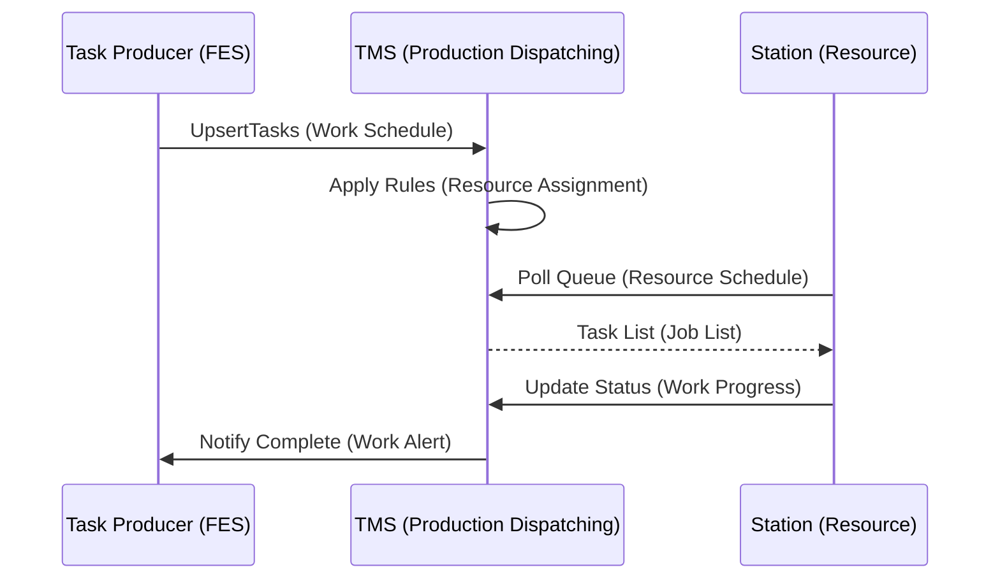

# TMS and ISA-95 Production Dispatching Mapping

## Overview
This document maps our Task Management Service (TMS) to ISA-95's Production Dispatching activity model (Part 2, Section 6.7).

## ISA-95 Production Dispatching Context

### Activity Model Interfaces (Figure 13)
ISA-95 defines Production Dispatching as the central activity that:
- Receives **Work Schedule** from above (Level 4)
- Interfaces with multiple Level 3 activities:
  - Production Resource Management
  - Product Definition Management  
  - Production Execution Management
  - Production Tracking
  - Production Data Collection

### Key ISA-95 Production Dispatching Tasks
According to Section 6.7.3, Production Dispatching includes:
- a) Issuing job orders as identified by the schedule
- b) Assigning local resources to production
- c) Releasing local resources to start job orders
- d) Handling conditions not anticipated in the work schedule

## TMS Architecture Mapping

### Core TMS Concepts → ISA-95 Mapping

| TMS Concept | ISA-95 Equivalent | Notes |
|-------------|-------------------|-------|
| Task | Job Order | The fundamental unit of work |
| Task Producer | Work Schedule source | FES and other systems that generate tasks |
| Station | Resource | Physical location where work is performed |
| Area | Resource Group | Logical grouping of stations |
| Station Queue | Resource Schedule | Tasks assigned to a specific station |
| Rules Engine | Dispatching Logic | Automated assignment of tasks to stations |

### Detailed Component Mapping

#### 1. Task Producers → Work Schedule
- **FES as Primary Producer**: Generates Work Order tasks, Proveout tasks, and Production tasks based on Process DAG
- **Other Producers**: Tool Logistics, Warehouse Management
- **Mapping**: Task Producers create the equivalent of ISA-95's "Work Schedule" inputs to Production Dispatching

#### 2. TMS Core → Production Dispatching Activity
The TMS performs all four key ISA-95 Production Dispatching tasks:

**a) Issuing job orders (Tasks)**
- TMS receives tasks via gRPC API from producers
- Persists tasks in PostgreSQL database
- Makes tasks available to appropriate areas/stations

**b) Assigning local resources**
- Rules Engine automatically routes tasks based on:
  - work_order_group_id
  - Tool holder type
  - Other task metadata
- Manual assignment also supported via UI

**c) Releasing local resources**
- Station UIs poll TMS for their task queue
- Operators can start tasks (UpdateTaskStatus → 'IN_PROGRESS')
- Resources are effectively "released" when tasks are made available in station queues

**d) Handling unanticipated conditions**
- Background workers check for stale tasks
- Work Alert system for exceptions
- Reconciliation logic when task state drifts

#### 3. Station Queues → Resource Schedule
- Each station has its own queue of assigned tasks
- Represents the local schedule for that resource
- Updated in real-time as tasks are assigned/completed

#### 4. TMS Interfaces → ISA-95 Activity Interfaces

**Work Capability (from Resource Management)**
- Station definitions with area_slug
- Capacity implied by queue management

**Work Master (from Product Definition)**
- Task metadata contains product/process information
- ODP (Operation Data Packets) referenced in tasks

**Job List (to Production Execution)**
- Tasks assigned to stations
- Status tracking (READY, IN_PROGRESS, COMPLETED)

**Work Alert (to Data Collection)**
- Task completion notifications back to FES
- Audit trail in tasks_audit table

## Key Architectural Differences

### 1. Centralized vs Distributed
- **ISA-95**: Assumes Production Dispatching might be distributed across production units
- **TMS**: Centralized service aggregating all tasks across the factory

### 2. Push vs Pull Model
- **ISA-95**: Often implies push-based job order distribution
- **TMS**: Pull-based with stations polling for their queues

### 3. Task Lifecycle Ownership
- **ISA-95**: Production Dispatching may own more of the execution lifecycle
- **TMS**: Clear separation - TMS owns assignment/queuing, stations own execution

### 4. Real-time Integration
- **ISA-95**: Batch-oriented interfaces common
- **TMS**: Real-time gRPC APIs with event-driven updates

## Implementation Notes

### Database Schema
The TMS database directly supports Production Dispatching concepts:
```
- tasks: Core job order/task storage
- stations: Resource definitions
- rules: Dispatching logic/rules engine
- tasks_audit: Historical tracking for analysis
- machining_assignments: Special resource allocation
```

### Background Workers
River-based workers handle ISA-95's "unanticipated conditions":
- Check worker: Monitors task health
- Cleanup worker: Maintains system hygiene

### Integration Pattern


## Summary
TMS implements ISA-95's Production Dispatching pattern with modern architectural choices:
- Centralized task aggregation and management
- Real-time, pull-based task distribution
- Rule-based automated dispatching
- Clear separation of concerns between task assignment (TMS) and execution (Stations)

The mapping is conceptually complete, with TMS fulfilling all Production Dispatching responsibilities while adapting them to our specific manufacturing context and technical constraints.
