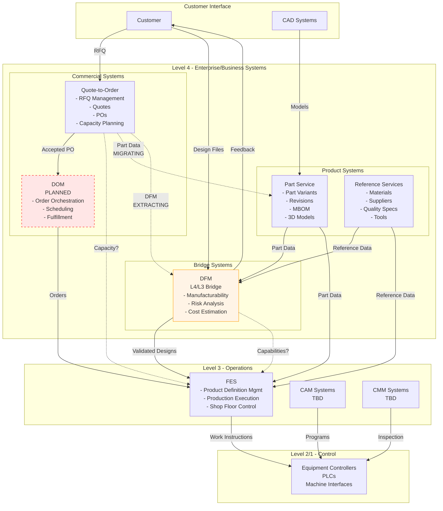
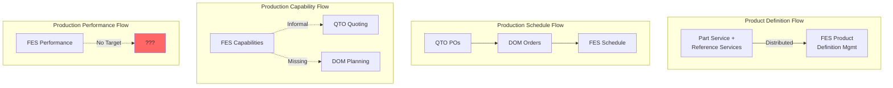
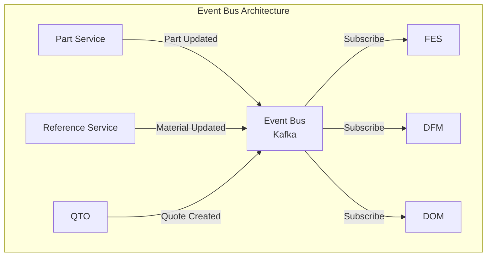

# System Architecture Overview

## Current State Architecture

### Level Overview Diagram

### System Inventory

#### Level 4 Systems (Enterprise/Business Layer)

##### Existing Systems
- **Quote-to-Order (QTO)**
  - RFQ management and customer quotes
  - Purchase order processing
  - Capacity planning for quotes
  - Customer relationship management
  - *Migrating*: Part data → Part Service, DFM → standalone

- **Part Service**
  - Customer part variants and internal revisions
  - Manufacturing Bill of Materials (MBOM)
  - 3D model management (STEP, GLB)
  - Part serialization formats

- **Reference Services**
  - Materials, suppliers, quality specifications
  - Thread specs, tool management
  - Single source of truth for manufacturing reference data

- **DFM (Design for Manufacturability)**
  - *Special*: Bridges L4/L3
  - Manufacturability analysis
  - Customer design feedback
  - Risk assessment and cost estimation

##### Planned Systems
- **Distributed Order Management (DOM)**
  - Order orchestration and scheduling
  - Priority management
  - Fulfillment tracking

#### Level 3 Systems (Operations/Manufacturing Layer)

##### Existing Systems
- **Factory Execution System (FES)**
  - [[ISA-95 Part 3 - Section 6.4.3 Tasks in Product Definition Management|Product Definition Management]]
  - Production scheduling and dispatching
  - Work order management
  - Shop floor data collection

- **CAM Systems** (to be documented)
- **CMM Systems** (to be documented)

#### Level 2/1 Systems (Control Layer)
- Equipment controllers
- PLCs and automation
- Direct machine interfaces

## ISA-95 Mapping

### How Our Systems Map to ISA-95 Concepts

| ISA-95 Concept | Our System(s) | Notes |
|----------------|---------------|-------|
| **Product Definition** (L4→L3 flow) | Part Service + Reference Services → FES | Distributed across multiple systems |
| **Production Capability** (L3→L4 flow) | FES → QTO (incomplete) | Missing formal capability reporting |
| **Production Schedule** (L4→L3 flow) | QTO → DOM → FES | Split across commercial and operations |
| **Production Performance** (L3→L4 flow) | FES → ??? | No unified performance analytics |
| **Order Processing** | QTO + DOM | Split: quote-to-order + order-to-fulfillment |
| **Product Cost Accounting** | Not implemented | Cost data scattered |
| **Product Inventory Control** | Not documented | Unclear ownership |
| **Operations Definition** | FES (Work Masters) | Per ISA-95 standard |

### ISA-95 Information Flows

See [[Information Flows – Enterprise ↔ Control  (ISA-95 Part 3 §6 & Figure 6)|ISA-95 Information Flows]] for detailed flow analysis.

### Activity Model Mapping

Per [[ISA-95 Part 3 Activity Model Reference|ISA-95's Eight Activities]]:

| ISA-95 Activity | Primary System | Status |
|-----------------|----------------|--------|
| 1. Product Definition Management | FES | ✓ Implemented (distributed inputs) |
| 2. Production Resource Management | FES | ✓ Partially implemented |
| 3. Detailed Production Scheduling | FES → DOM | ⚠️ Transition planned |
| 4. Production Dispatching | FES | ✓ Implemented |
| 5. Production Execution Management | FES | ✓ Implemented |
| 6. Production Data Collection | FES | ✓ Implemented |
| 7. Production Tracking | FES | ✓ Implemented |
| 8. Production Performance Analysis | ??? | ✗ No system |

## Architectural Analysis

### 1. System Overlaps and Duplication

#### Part Data Fragmentation
- **Issue**: Part data in QTO (migrating), Part Service, and DFM
- **Risk**: Data inconsistency during migration
- **See**: [[Open Questions - ISA-95 Mapping#5. Product Definition Authority]]

#### Capacity Planning Duplication
- **Issue**: Capacity in QTO, FES, and future DOM
- **Risk**: Misaligned capacity views
- **See**: [[Open Questions - ISA-95 Mapping#1. Shared Capacity Service Architecture]]

### 2. Missing Systems

- **Unified Capacity Service**: Single source of truth for capacity
- **Production Performance Analytics**: Level 4 analytics platform
- **Product Cost Accounting**: Formal costing system
- **Master Data Management**: Governance for shared data

### 3. Key Deviations from ISA-95

1. **Distributed Product Definition**: Multiple L4 systems vs single source
2. **Bridge Systems**: DFM spans levels (not in ISA-95 model)
3. **Capacity at Wrong Level**: Planning at L4 instead of L3
4. **Customer Integration**: External interfaces not covered by ISA-95

### 4. Integration Patterns

#### Current: Point-to-Point
- O(n²) complexity
- Tight coupling
- Difficult to maintain

#### Proposed: Event-Driven

## Migration and Evolution

### In Progress
- Part data: QTO → Part Service
- DFM extraction from QTO
- DOM implementation planning

### Recommendations

#### Immediate Actions
1. Complete migrations before DOM build
2. Define DOM interfaces clearly
3. Establish data governance

#### Medium-term
1. Build Capacity Service
2. Implement Event Bus
3. Create Analytics Platform

#### Long-term
1. Consider FES decomposition
2. Standardize integration patterns
3. Establish architecture governance team

## Related Documentation
- [[ISA-95 Part 3 - Section 6.4.3 Tasks in Product Definition Management]] - Deep dive on PDM
- [[ISA-95 Roles vs Locations]] - How functions map to systems
- [[Open Questions - ISA-95 Mapping]] - Architectural decisions needed
- [[Understanding ISA-95 Activity Model]] - Conceptual understanding of activities
- [[Information Flows – Enterprise ↔ Control  (ISA-95 Part 3 §6 & Figure 6)]] - Four canonical flows