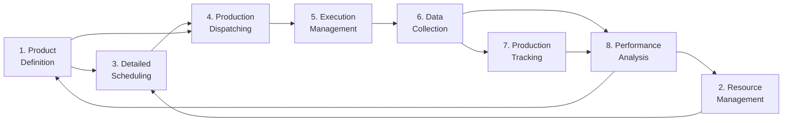

# Understanding ISA-95's Activity Model

*For the canonical list of activities, see [[ISA-95 Part 3 Activity Model Reference]]*

## Purpose of This Page

This page explains the **conceptual framework** behind ISA-95's Activity Model - the "why" and "how to think about it." 

For:
- **The official list** → [[ISA-95 Part 3 Activity Model Reference]]
- **Our implementation** → [[System Architecture Overview#Activity Model Mapping]]
- **Specific activities** → Individual deep dives (e.g., [[ISA-95 Part 3 - Section 6.4.3 Tasks in Product Definition Management|Product Definition Management]])

## Core Intuition

The Activity Model is ISA-95's answer to a fundamental question: **"What work needs to be done to run manufacturing operations, regardless of how you organize it?"**

Think of it as identifying the irreducible "verbs" of manufacturing operations - the things that MUST happen somewhere in your system, whether you have one monolithic MES or 50 microservices.

## Why Activities, Not Systems?

ISA-95 deliberately describes **activities** (what needs to be done) rather than **systems** (software that does it) because:

1. **Technology changes, activities don't** - You'll always need to manage product definitions, even if the system doing it changes
2. **Organizations vary** - Some companies put scheduling in ERP, others in MES, but the scheduling activity still exists
3. **Boundaries shift** - System boundaries change with reorgs and upgrades, but the work remains

## The Eight Activities as a Checklist

Think of the eight activities as a completeness check for Level 3:

```
□ 1. Product Definition Management - Do we know HOW to make products?
□ 2. Production Resource Management - Do we know WHAT resources we have?
□ 3. Detailed Production Scheduling - Do we know WHEN to make things?
□ 4. Production Dispatching - Can we START production?
□ 5. Production Execution Management - Can we CONTROL production?
□ 6. Production Data Collection - Can we CAPTURE what happened?
□ 7. Production Tracking - Can we TRACE products through production?
□ 8. Production Performance Analysis - Can we IMPROVE based on results?
```

If any box is unchecked, you have a gap in your operations capability.

## The Network, Not Hierarchy

While often listed 1-8, these activities form a **network** of interactions:



Each activity needs inputs from others and provides outputs that others consume.

## Information Flows Between Activities

The magic is in the **interfaces** between activities. ISA-95 Part 3 spends most of its pages defining these information exchanges:

- **Product Definition → Scheduling**: "Here's what can be made"
- **Resource Management → Scheduling**: "Here's what we have to work with"
- **Scheduling → Dispatching**: "Here's the sequence"
- **Performance Analysis → Everything**: "Here's how we actually performed"

## Your Architecture's Activity Distribution

In your current state:
- **FES owns 7 of 8 activities** - This is common but creates a monolith
- **Activity 8 (Performance Analysis) is orphaned** - No clear owner
- **Some activities are split** (e.g., scheduling between FES and future DOM)

This concentration in FES isn't necessarily wrong, but it means:
1. FES is critical - if it fails, everything stops
2. Changes to any activity might impact others in the same system
3. Scaling challenges - can't scale scheduling independently from execution

## Using the Activity Model for Design

When designing your DOM or any new system, ask:

1. **Which activities are we moving/splitting?**
   - DOM will take some scheduling from FES
   - Will it also need resource management data?

2. **What are the interfaces?**
   - If scheduling moves to DOM, how does it tell FES what to make?
   - What's the data contract between them?

3. **Are we creating gaps?**
   - If DOM does order scheduling but FES does detailed scheduling, who coordinates?
   - Where does the handoff happen?

## The "Functional Decomposition" Mindset

The Activity Model represents **functional decomposition** - breaking down "run manufacturing" into its essential functions:

```
Run Manufacturing Operations
├── Know what to make (Activity 1)
├── Know what you have (Activity 2)
├── Decide when to make it (Activity 3)
├── Start making it (Activity 4)
├── Control the making (Activity 5)
├── Record what happened (Activity 6)
├── Track where things are (Activity 7)
└── Learn from results (Activity 8)
```

This decomposition helps ensure nothing falls through the cracks.

## Common Pitfalls

1. **Thinking activities = systems** - One system can do multiple activities, one activity can span systems
2. **Ignoring the interfaces** - The data flows between activities are as important as the activities
3. **Sequential thinking** - These happen in parallel with feedback loops, not in sequence
4. **Level confusion** - These are Level 3 activities; Level 4 has its own (business) activities

## The Bottom Line

The Activity Model is a **functional architecture** for manufacturing operations. It says "these eight things must happen somewhere in your Level 3" without prescribing how you organize systems to accomplish them.

Your job is to:
1. Ensure all eight activities are covered
2. Design clean interfaces between them
3. Assign them to systems in a way that makes sense for your business
4. Monitor that no activity becomes an orphan during system evolution

## Related Reading
- [[ISA-95 Part 3 Activity Model Reference]] - The canonical list
- [[System Architecture Overview#Activity Model Mapping]] - How we implement them
- [[ISA-95 Roles vs Locations]] - Activities vs organizational structure